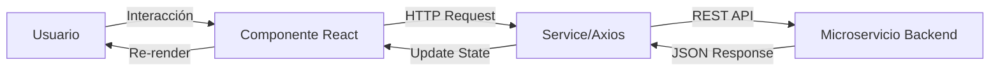
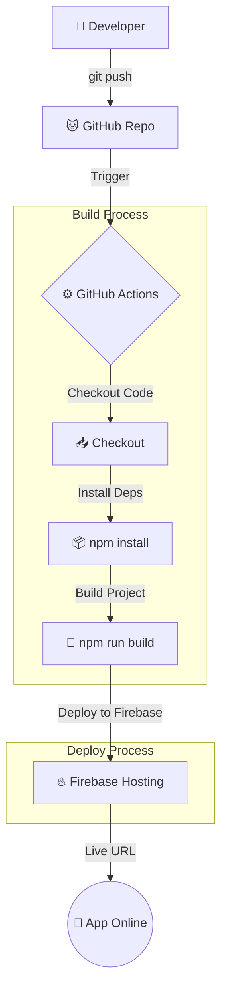

# InsightFlow Frontend

Aplicación web para la plataforma InsightFlow. Integrada con microservicios, con despliegue automático en Firebase Hosting mediante CI/CD.

## Descripción

InsightFlow Frontend proporciona una interfaz moderna y responsive para la gestión completa de proyectos, tareas y usuarios de la plataforma.

## Flujo de los datos



## Seguridad (JWT Auth)

El frontend implementa autenticación basada en tokens:

1. Tras login exitoso, el backend devuelve un JWT token
2. El token se guarda en cookies (js-cookie)
3. Axios intercepta las peticiones y añade el header automáticamente:   
```
   Authorization: Bearer <token>
```
4. Si el token expira o no existe, el usuario es redirigido al Login.
   
## Estructura del proyecto

```
insightflow-frontend/
├── src/
│   ├── auth/              # Módulo de Autenticación (Login, Register)
│   ├── tasks/             # Módulo de Tareas (Vistas, Componentes)
│   ├── components/        # Componentes reutilizables (Layout, Navbar, PrivateRoute)
│   ├── hooks/             # Custom Hooks
│   ├── interfaces/        # Definiciones de tipos TypeScript
│   ├── services/          # Configuración de Axios y llamadas a API
│   ├── css/               # Estilos globales y específicos
│   ├── App.tsx            # Configuración de Rutas principal
│   └── main.tsx           # Punto de entrada
├── public/                # Assets estáticos
├── .github/workflows/     # Configuración de CI/CD (Firebase)
├── firebase.json          # Configuración de Hosting
└── vite.config.ts         # Configuración de Vite
```

## Tecnologías usadas

### Tecnologías principales

#### Core Framework
- **React 18.2**: Librería principal para interfaces de usuario
- **TypeScript 5.0**: Tipado estático para JavaScript
- **Vite 5.0**: Build tool y dev server ultra rápido

#### Dependencias principales
- **React Router DOM 6.x**: Enrutamiento y navegación SPA
- **Axios 1.6**: Cliente HTTP para peticiones a APIs
- **js-cookie 3.0**: Manejo de cookies para autenticación

### DevOps y despliegue
- **Firebase Hosting**: Plataforma de despliegue.
- **GitHub Actions**: Pipeline de integración y despliegue continuo.
  
## Requisitos

- [Node.js v18+](https://nodejs.org/) - Runtime de JavaScript
- [npm 9+](https://www.npmjs.com/) o [yarn 1.22+](https://yarnpkg.com/) - Gestor de paquetes
- [Git](https://git-scm.com/) - Control de versiones

```bash
# Verificar Node.js
node --version
# Output esperado: v18.x.x o superior

# Verificar npm
npm --version
# Output esperado: 9.x.x o superior
```

## Instalación y configuración

## 1.Clonar repositorio
```bash
$ git clone https://github.com/InsightFlowTaller3ArquietcturaDeSistema/insightflow-Frontend.git
cd insightflow-frontend
```

## 2.Instalar Dependencias

```bash
# Con npm
npm install

# Con yarn
yarn install
```

### 2.1. Ejecución Local

```bash
# Con npm
npm run dev

# Con yarn
yarn dev  
```
La aplicación estará disponible en:

- URL Local: http://localhost:5173/
- URL Red: https://insightflow-frontend-39727.web.app/


## CI/CD Pipeline



#### Secrets necesarios

- **GITHUB_TOKEN**: Token Github
- **FIREBASE_SERVICE_ACCOUNT_INSIGHTFLOW_FRONTEND_39727**: Token servicio firebase

## Integración con Backend

El frontend actúa como un orquestador que consume múltiples microservicios independientes desplegados en Render. Cada servicio maneja una parte específica del dominio de negocio.


Servicio|URL Base (Render)|
|--|--|
|Tasks Service|https://task-service-5dmf.onrender.com
|Users Service|https://user-services-13hx.onrender.com
|Documents Service|https://insightflow-documents-drw9.onrender.com
|Workspaces Service|(URL de tu servicio de espacios)

### 1. Documents Service

| Método HTTP | Endpoint            | Descripción                                           |
|-------------|---------------------|-------------------------------------------------------|
| GET         | /documents          | Obtiene la lista de documentos disponibles.           |
| GET         | /documents/{id}     | Obtiene el contenido completo (bloques JSON).         |
| POST        | /documents          | Crea un nuevo documento vacío.                        |
| PATCH       | /documents/{id}     | Actualiza título, ícono o contenido.                  |
| DELETE      | /documents/{id}     | Elimina un documento.                                 |

### 2. Task Service

| Método HTTP | Endpoint                           | Descripción                                                         |
|-------------|------------------------------------|----------------------------------------------------------|
| GET         | /api/tasks/tasks                   | Obtiene el listado global de todas las tareas.                      |
| GET         | /api/tasks/{id}                    | Obtiene los detalles específicos de una tarea.                     |
| GET         | /api/tasks/document/{id}/tasks     | Tareas vinculadas a un documento específico.                       |
| GET         | /api/tasks/users/{id}/tasks        | Tareas asignadas a un usuario específico.                          |
| POST        | /api/tasks                         | Crea una nueva tarea (Estado inicial: PENDING).                    |
| PUT         | /api/tasks/{id}/status             | Actualiza estado (PENDING → IN_PROGRESS → COMPLETED).              |
| PATCH       | /api/tasks/{id}                    | Actualiza detalles (título, prioridad, fecha).                     |
| DELETE      | /api/tasks/{id}                    | Elimina lógicamente una tarea.                                     |

### 3. User Service

| Método HTTP | Endpoint               | Descripción                                             |
|-------------|------------------------|---------------------------------------------------------|
| POST        | /auth/login            | Valida credenciales y retorna Token JWT.               |
| GET         | /usuario/users         | Obtiene el listado completo de usuarios.               |
| GET         | /usuario/users/{id}    | Obtiene el perfil detallado de un usuario.             |
| PATCH       | /usuario/users/{id}    | Actualiza perfil (nombre, correo, contraseña).         |
| DELETE      | /usuario/users/{id}    | Desactiva o elimina un usuario.                        |

### 4. Workspace Service

| Método HTTP | Endpoint             | Descripción                                           |
|-------------|----------------------|-------------------------------------------------------|
| GET         | /workspaces          | Lista los espacios donde el usuario es miembro.       |
| GET         | /workspaces/{id}     | Obtiene detalles del espacio y miembros.              |
| POST        | /workspaces          | Crea un nuevo espacio de trabajo.                     |
| PUT         | /workspaces/{id}     | Actualiza nombre o configuración.                     |
| DELETE      | /workspaces/{id}     | Elimina un espacio de trabajo.                        |

#### Notas
- Seguridad: Todas las peticiones a estos endpoints (excepto Login/Registro) deben incluir el header Authorization: Bearer <token>.

- Manejo de Errores: El frontend intercepta los errores 401 Unauthorized de cualquiera de estos servicios para redirigir al usuario al Login y limpiar las cookies.
